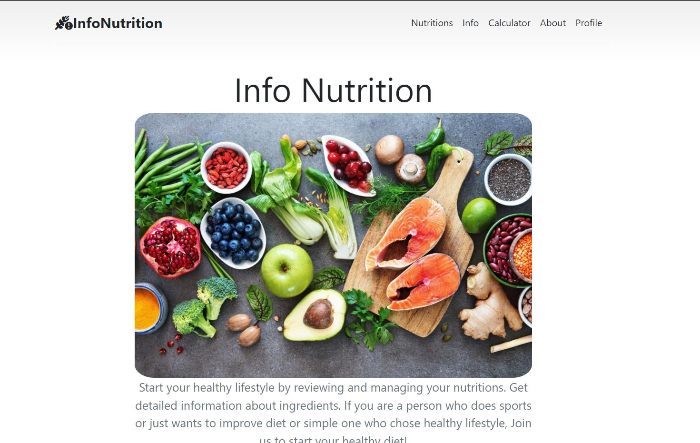
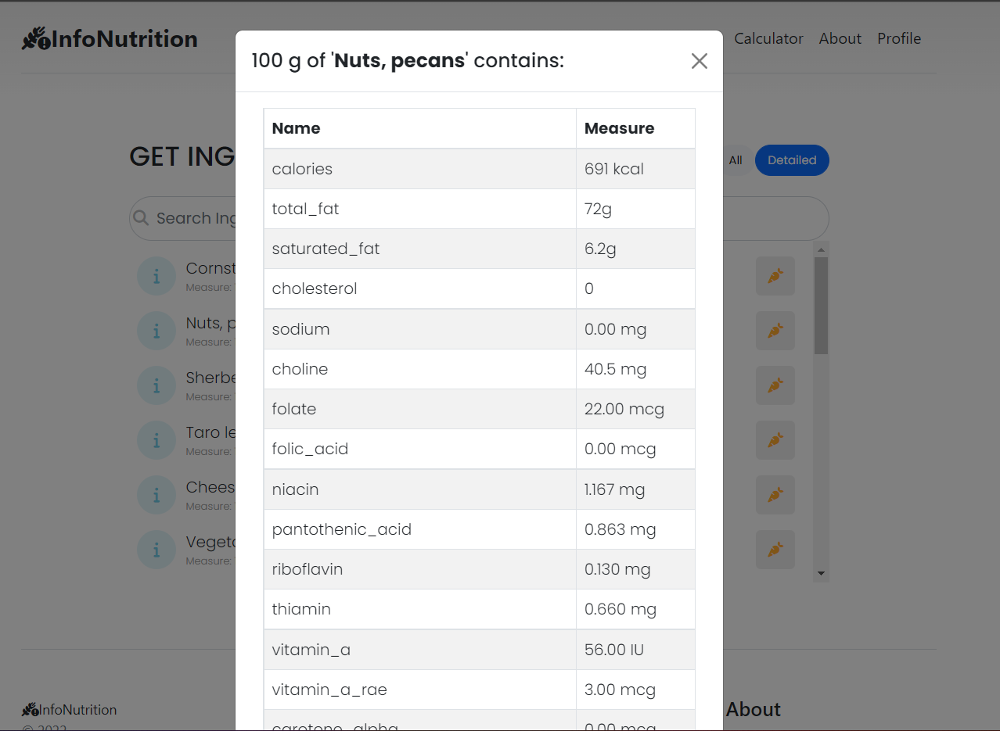

# InfoNutrition



### Language: python 3.9 +

### Frameworks : Django 4+

### Technologies: Google Alluth authentication, RDA research

### Deployment: gunicorn, NGINX, Docker, docker-compose

### Database : postgresql 12+

## Live: [https://shohjahonh.pythonanywhere.com/](https://shohjahonh.pythonanywhere.com/)


# About
Website that helps people for their diet and healthy lifestyle with food. Get detailed nutrition information about 15,000 products. Get your daily recommended consumption calclated according https://nap.nationalacademies.org/catalog/11537/dietary-reference-intakes-the-essential-guide-to-nutrient-requirements
See what product contains usefull Macronutrient, Vitamins and Minerals. 




# Project Setup

## Process

Found raw data from kaggle in csv format, cleared, filtered and added to database. 

Read DRI research paper and filtered values to calculate Daily Recommended consumption. 

#### Django project run

```bash
>>> docker-compose up -d --build
```

# Architecture

```
.
└── app
    └── nutrition
        ├──  migrations
        ├──  __init__.py
        ├──  admin.py
        ├──  apps.py
        ├──  models.py
        ├──  serializer.py
        ├──  service.py
        ├──  tests.py
        ├──  urls.py
        ├──  views.py
    └──  config
        ├──  __init__.py
        ├──  asgi.py
        ├──  urls.py
        ├──  settings.py
        ├──  wsgi.py
        
    ├── .gitignore
    ├── .gitlab-ci.yml
    ├──  manage.py
    ├──  requirements.txt
```

### models.py

```python
from core.base_model import BaseModel
from django.db import models


class MyModel(BaseModel):
    name = models.CharField(max_length=255)

    def __str__(self):
        return self.name
```

### views.py

## urls.py

```python
from django.urls import path

'from .views import MyView'

urlpatterns = [
    path("article/", views.article, name="article"),
]
```

### main.urls.py

```python
from django.urls import path, include

urlpatterns = [
    path('/api/v1/{app_name}/', include('{app_name.urls}'))
]
```

# NOTE:
## This Project is just simple representation.

# Currently  Rebuilding Whole project using: FastAPI + MongoDB + ReactJs
